# Cyberpunk 2088 #

## Introduction ##

Cyberpunk 2088 is a 2D infinite progression game set in a neon-drenched, dystopian city teetering on the edge of chaos. Players take on the role of "W," a fearless mercenary on a mission to overthrow the oppressive Arasaka Corporation, a megacorporation that has plunged society into despair. Combining high-octane combat, endless level progression, and strategic upgrades, the game offers an exhilarating journey through an ever-evolving cyberpunk world. The ultimate goal is to infiltrate Arasaka's towering fortress, a sprawling skyscraper dominating the city skyline. However, upon breaching its inner sanctum, players uncover an unsettling truth: the interior is an infinite, procedurally generated loop, reflecting Arasaka’s mastery over both technology and reality. With dynamic action and engaging enemies, Cyberpunk 2088 immerses players in a world where every battle pushes them closer to uncovering the secrets of a system built to control them. Will you break free or become another cog in the machine?

## Project Resources

1. [Web-playable version of your game.](https://zhxu33.itch.io/cyberpunk-2088)  
2. [Trailor](https://www.youtube.com/watch?v=RgVgY8-F4nA)  
3. [Press Kit](https://languid-capacity-e83.notion.site/Cyberpunk-2088-15b706d55ba380758870fa84dc694b72)  
4. [Group Project Google Drive Folder](https://drive.google.com/drive/folders/1R5iv0R0Rx2gkmcWxXha3Wvq6lbOll6oC?usp=drive_link).
    4.1 [Group Initial Plan](https://docs.google.com/document/d/1TuI_5MxxG3TNvrD7Z8iwSdKDze4Wr04ZUydlNR9okWQ/edit?usp=sharing).
    4.2 [Group Progress Report](https://docs.google.com/document/d/12pQWgevDNh7WiyPMqM3151Qtb58PCUFHTxBVsjFJRXc/edit?usp=sharing).
    4.3 [Tester Comments Image from Final Festival 5 game tester comments](https://drive.google.com/file/d/1tn4Yijyf3Z--mwvjm6qE0DpVtvh7e7A6/view?usp=sharing).
    4.4 [Tester Comments Image from Game Night](https://drive.google.com/file/d/1VrLXNo-Ml2-__yk4NkgFRX27WTnjZDqs/view?usp=sharing).
    4.5 [Game Night Attendence](https://drive.google.com/file/d/1ugxaDAAzInmYY1SF0_6bfvD0VU_44uEw/view?usp=sharing).

## Gameplay Explanation ##

**In this section, explain how the game should be played. Treat this as a manual within a game. Explaining the button mappings and the most optimal gameplay strategy is encouraged.**

**Cyberpunk 2088 is a 2D FPS shooting game that can be upgraded by fighting monsters.**

| Keyboard operation               | Key |
|:--------------------------------:|:-----:|
|Move Right                        |   D  |
|Move Left                         |   A | 
|Jump (contain double jump)        |   W & Space  | 
|Teleport                          |   R (hold)   | 
|Shooting                          |   Left mouse button  | 
|Melee attack                      |   Right mouse button | 

**Recommendation of Game playing**
As the player, you will see an NPC near the spawn location. At the beginning of the first level, you will have 100 coins to upgrade your skill at the NPC store and there are about 12 types of skills you can choose. As the designer, we prefer you to choose Movement speed. After upgrading, the next step is to explore the MAP. On the map, you will kill all the enemies that stop your way and they will drop coins to let you collect and upgrade. When you think you have enough coins, you can press "R" to teleport back to the first NPC you met at the beginning of the game. Then, it's time to upgrade other skills! We don't have any skills for healing the player, but you can collect the heart will might be dropped by enemies. When you explore the map, you will see some other NPC for you to upgrade your skills so DON'T WORRY! Then, when you finally reach the boss room. FIGHT IT and KILL it! Then, get into the portal and you will get into the next level of the game. The HP of the enemy and the damage will increase!! BE CAREFUL!

**THREE TYPES OF ENEMIES**
1. Self-destruct Slim (When you reach the range, they will chase you, and BOOM! PLEASE!! Playe safe and stay in the safe area)
2. Cyber Ninjia (They are samurai patrolling with electric light knives, be careful not to go near them because their knives will tear you to pieces）
3. Robot guard dog (Don't worry! They're good enough to stand still but they'll detect you at a distance and want you to fire a cannonball. It's a long way! Please take shelter in time!）

**TWO TYPES OF BOSS**

# Main Roles #

Your goal is to relate the work of your role and sub-role in terms of the content of the course. Please look at the role sections below for specific instructions for each role.

Below is a template for you to highlight items of your work. These provide the evidence needed for your work to be evaluated. Try to have at least four such descriptions. They will be assessed on the quality of the underlying system and how they are linked to course content. 

*Short Description* - Long description of your work item that includes how it is relevant to topics discussed in class. [link to evidence in your repository](https://github.com/dr-jam/ECS189L/edit/project-description/ProjectDocumentTemplate.md)

Here is an example:  
*Procedural Terrain* - The game's background consists of procedurally generated terrain produced with Perlin noise. The game can modify this terrain at run-time via a call to its script methods. The intent is to allow the player to modify the terrain. This system is based on the component design pattern and the procedural content generation portions of the course. [The PCG terrain generation script](https://github.com/dr-jam/CameraControlExercise/blob/513b927e87fc686fe627bf7d4ff6ff841cf34e9f/Obscura/Assets/Scripts/TerrainGenerator.cs#L6).

You should replay any **bold text** with your relevant information. Liberally use the template when necessary and appropriate.

## Producer

**Describe the steps you took in your role as producer. Typical items include group scheduling mechanisms, links to meeting notes, descriptions of team logistics problems with their resolution, project organization tools (e.g., timelines, dependency/task tracking, Gantt charts, etc.), and repository management methodology.**

## User Interface and Input - James Xu

### User Interface

The `Interface` scene is placed directly under the root node `World`, where other scripts can easily access and manipulate the UI. The scene contains a `Canvas` layer, which contains all of the game UI elements including `StartScreen`, `Health`, `Coins`, `Level`, `Dialogue`, `Shop`, `EndScreen`, and `Blackout`.

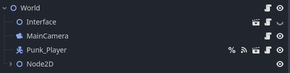
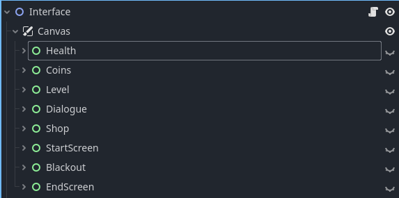

Each UI element is placed under a control node, where I assign Anchor Presets so that the positioning is responsive and works with different screen sizes. The screen resolution only defaults to 1920x1080 for now, but the plan was to add mobile support if we had more time.

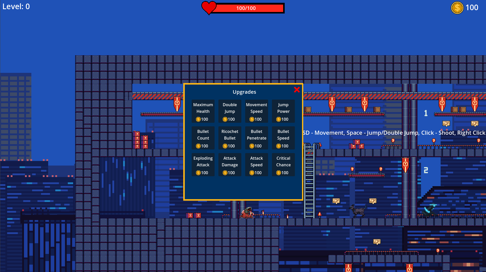

The Interface scene contains a master script [`interface.gd`](https://github.com/zhxu33/cyberpunk2088/blob/main/cyberpunk2088/scripts/interface/interface.gd) which handles all UI interactions. I set up [`stats.gd`](https://github.com/zhxu33/cyberpunk2088/blob/main/cyberpunk2088/scripts/global/stats.gd) which contains autoload global variables including `coins`, `level`, `health`, `max_health,` and `upgrades`. This is accessed in the interface to display player statuses.

### Start Screen
The start screen appears when the player first joins the game. It has a `Title` label and a blue `Background` ColorRect that fades out over 2 seconds, which transitions into the game map and player. After the blue background fades, the player can press Start Game `Button` to begin playing.

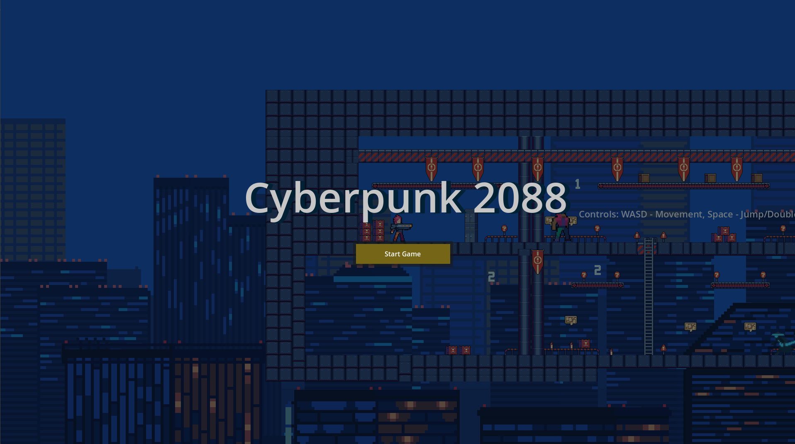

### Health Bar
The Health Bar is displayed on the center top of the screen `Canvas`. It contains a `ProgressBar` node, which stores the player's `max_health` into Min Value, and player's `health` into value. It contains a `TextureRect` heart icon and `Label` indicating the player's health.

### Coin
The coins are displayed on the top right corner of the screen `Canvas`, which is the game currency used to purchase upgrades. It contains a coin `TextureRect` icon on the left of the `Label` value.

### Level
The level `Label` is displayed on the top left corner of the screen canvas, indicating the current difficulty of the game.

### Dialogue
The dialogue is displayed on the center bottom of the screen `Canvas`. It contains a `Title` label, `Text` description label, `Cancel`, and a `Confirm` button. Pressing the cancel button will always close the dialog without doing anything.

The Merchant Biker has a dialogue where pressing `Confirm` will open up the shop UI.

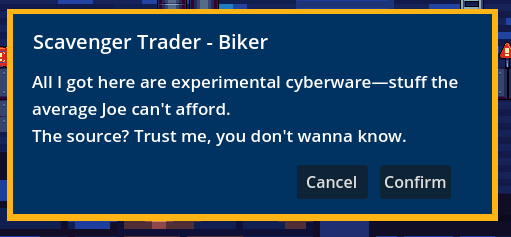

The portal has two dialog states depending on the status of the boss.

If the boss is dead, the player can proceed to the next level by pressing `Confirm`. 

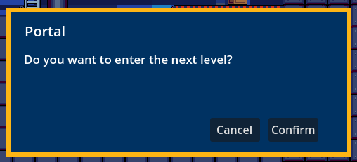

If the boss is alive, pressing `Confirm` will not do anything.

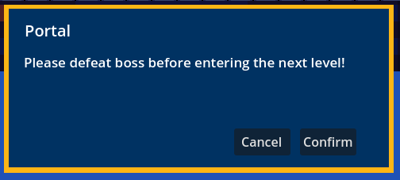

### Shop
The shop opens after pressing `Confirm` on the Biker dialogue. There is a `Close` button on the top right corner which is used to exit the shop. It has a `Title` "Upgrades" and contains a `GridContainer` inside a `ScrollContainer` which is designed to format the `UpgradeItem` node automatically, and adds a scroll wheel incase the shop interface isn't big enough to fit all upgrades.

The `UpgradeItem` node contains a  upgrade name `Label`, `Cost` label, `CoinIcon`, and a `Button` with transparent black background which can be clicked on to upgrade. In the interface script, `UpgradeItem` node is cloned based on the available `upgrades` in `stats.gd` and placed under the `GridContainer`.

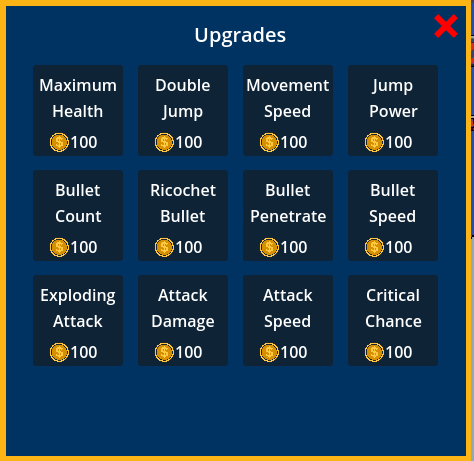

### Death Screen
Once the player's health reaches 0, the death screen becomes visible and all inputs are disabled. It contains a Game Over `Title` label and a New Game `Button` to restart the game from level 0 with all upgrades and coins reset. 

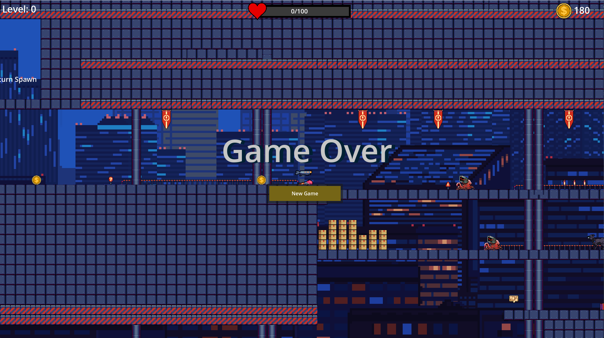

### Blackout
This is a blue `Background` ColorRect used for transitioning between levels, or when starting a new game after death. The background fades in for 0.5 seconds, waits 1 second, and then fades out 1 second during a transition.

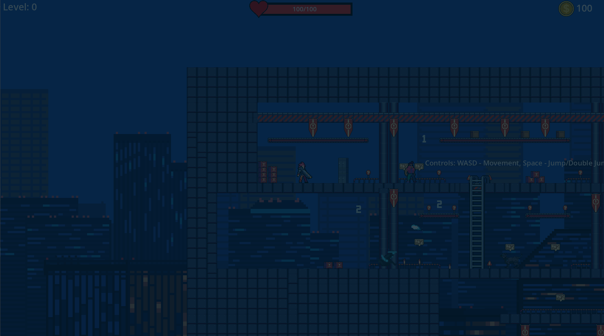

### User Input

The game input is configured in the project's Input Map settings. This currently only supports players with a mouse and keyboard. All inputs are handled in `player.gd` physics process. Inputs are disabled when the Start Screen or Death Screen is open, and re-enabled once the player starts a new game.

* `move_left`: hold **A** or **Left Arrow** key.
* `move_right`: hold **D** or **Right Arrow** key.
* `jump`: Press **W**, **Space**, or **Up Arrow** key. Also used for double jump and climbing ladders.
* `ranged_attack`: Hold **Left Click**
* `meele_attack`: **Right Click**
* `return`: Hold **R** for 1 second to teleport back to spawn.
* `tp_cheat`: Press **R** to teleport to the direction of mouse. Used for testing purposes.

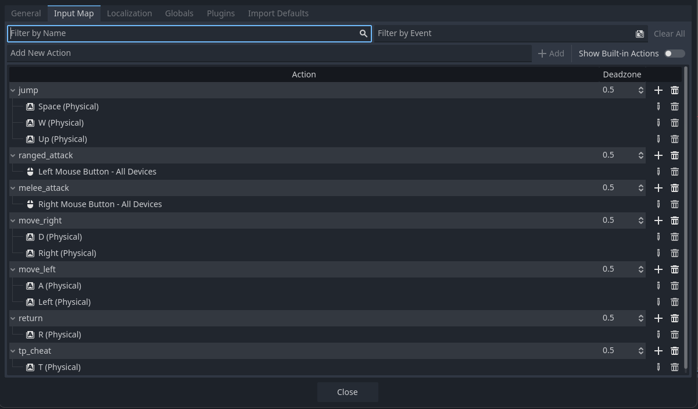

## Movement/Physics

**Describe the basics of movement and physics in your game. Is it the standard physics model? What did you change or modify? Did you make your movement scripts that do not use the physics system?**
We contain two essential folders in the script folder: character and command. They include the main movements and any other important physics of the game characters and enemies. 

**Movement is velocity-based, with separate horizontal and vertical components**
The character system implements:
* Left/right movement with constant velocity
* Jumping mechanics with initial jump velocity
* Double jump system based on upgrade levels
* Climbing mechanics on ladders
* A zero-velocity idle state

**As what we learned from the exercise 1 to exercise 3, our game uses Godot's standard physics model with some customization**
* It uses CharacterBody2D's built-in velocity and physics processing
* Maintains the standard gravity system (inherited from Character class)
* Uses the built-in floor detection for jump mechanics
* Employs the standard delta-time-based physics processing
**There are several custom modifications are implemented for the player (character)**
  * Custom movement speed system that scales with upgrades: `movement_speed = DEFAULT_MOVE_VELOCITY + Stats.upgrades["Movement Speed"]*20`
  * Modified jump velocity that scales with upgrades: `jump_velocity = DEFAULT_JUMP_VELOCITY - Stats.upgrades["Jump Power"]*25`
  *  Custom ladder physics that overrides vertical movement: `velocity.y = -movement_speed` when climbing
  * Custom double jump system that:
      * Tracks jump count
      * Only allows additional jumps when falling (velocity.y >= 0)
  * Limits jumps based on upgrade level: `jump_amount <= Stats.upgrades["Double Jump"]`
**In our custom movements scripts we use custom movement scripts through the command pattern and they still work within the physics systems:**
 * `MoveLeftCommand` and `MoveRightCommand` handle horizontal movement by directly setting velocity.x
 * `JumpCommand` controls vertical movement by setting velocity.y
 * `IdleCommand` handles stopping by zeroing horizontal velocity
 * The commands are bound and unbound through `bind_player_input_commands() and `unbind_player_input_commands()`

**All we did is like what we did in exercise 1**
**In addition, the enemy's movement and physical system are similar to what we did for the game character（player)**

## Animation and Visuals

1. [character & NPC](https://free-game-assets.itch.io/free-3-cyberpunk-sprites-pixel-art)                      
2. [Backgroud](https://free-game-assets.itch.io/free-city-backgrounds-pixel-art).                      
3. [Tileset](https://free-game-assets.itch.io/free-industrial-zone-tileset-pixel-art).      
4. [Protal](https://www.pngall.com/portal-png/download/33556/#google_vignette).                    
5. [Coins](https://www.flaticon.com/free-icon/coin_217802).                         
6. [Heart](https://reserve.freesvg.org/red-heart-with-black-outline).                      
7. [Weapons and Bullets](https://free-game-assets.itch.io/free-guns-for-cyberpunk-characters-pixel-art).|
**Describe how your work intersects with game feel, graphic design, and world-building. Include your visual style guide if one exists.**

## Game Logic - Aaron Shan (shyshan@ucdavis.edu)

**Document the game states and game data you managed and the design patterns you used to complete your task.**
**World Management**
The game [world](https://github.com/zhxu33/cyberpunk2088/blob/8d7a970efad04fd0dad5144f9eb6f5c1f833ce91/cyberpunk2088/scripts/world.gd#L1) is designed as a system of sub-systems providing for various aspects of the gameplay. Fundamentally, the world is the maps, enemies, bosses, and NPCs that go into making up the whole game.
**Map Generation System**
Randomly selectable are [two principal maps](https://github.com/zhxu33/cyberpunk2088/blob/1f936a282df19a1f0fc453156f62eb676ab69458/cyberpunk2088/scripts/world.gd#L27), which the world keeps; one can be selected for a new level. These maps already exist in the memory when the game begins and so can be accessed immediately when required. 

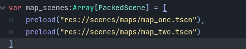

**Character Management**
The world handles three main types of characters:
* Regular Enemies (dogs, samurai, and slimes)
* Boss Characters(different types of powerful enemies)
* NPCs(merchants who can interact with the player)
* Players (merchants who can interact with the player)
All these characters are stored in separate collections, making it easy to spawn the right type of character when needed.
**Character Management**
The world handles three main types of characters:
* Regular Enemies (dogs, samurai, and slimes)
* Boss Characters(different types of powerful enemies)
* NPCs(merchants who can interact with the player)
* Players (merchants who can interact with the player)
All these characters are stored in separate collections, making it easy to spawn the right type of character when needed.

### Player (Character)

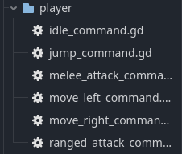

Any action that what player will do based on a command, we contained in the player's folder, but the main instructions are still written in the `player.gd`. 

**Combat System**: The player features a dual-combat system with both ranged and melee capabilities.
* [Ranged Combat](https://github.com/zhxu33/cyberpunk2088/blob/c7eeb37dbb8d9666f9e0dbcc4e84a139000d0612/cyberpunk2088/scripts/characters/player.gd#L74):
  * When a player wants to use a `ranged attack` by pushing the key `mouse left button`, first the game would consider the cooldown_elapsed of the player's shot. If it has, the player fires a ranged attack on the enemies.
     * **Cooldown System**:
     * Base cooldown: 0.75 seconds
     * Reduced by Attack Speed upgrades (0.05s per level)
     * Tracked by cooldown_elapsed counter
   
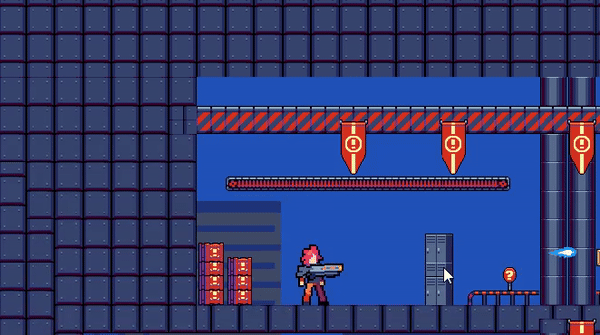

* [Melee Combat](https://github.com/zhxu33/cyberpunk2088/blob/c7eeb37dbb8d9666f9e0dbcc4e84a139000d0612/cyberpunk2088/scripts/characters/player.gd#L101):
  * The melee system works similarly but has a longer waiting period - about 1.6 times longer than ranged attacks. When the player presses the `mouse right button`, the game checks if enough time has passed (using cooldown_elapsed2), then performs the melee attack if you're ready. This makes melee attacks slower but potentially more powerful than ranged attacks.

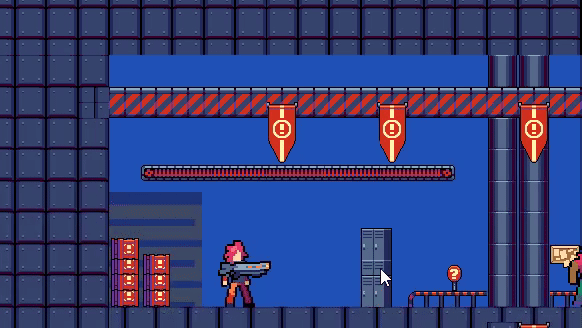

* [Damage System Explanation](https://github.com/zhxu33/cyberpunk2088/blob/c7eeb37dbb8d9666f9e0dbcc4e84a139000d0612/cyberpunk2088/scripts/characters/player.gd#L118)
   * When the character takes damage, several things happen in sequence:
      * First, the game checks if the player's already dead - if yes, no more damage is taken
      * If the player's alive, it creates floating damage numbers above your character showing how much damage you took
      * Your health drops to zero or below

**Reset and Death Explanation**
* This system handles both what 

**Enemy and Player Placement System and Other Boss systems WILL BE INTRODUCE in the Sub role - Map Design Part**
**Level Progression - How Levels Advance**
After the player killed the boss. We designed a Portal to let the player enter the next level.

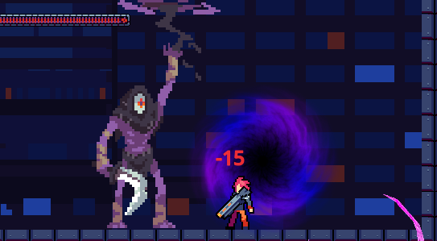

The portal will detect the status that we set for it. when the status `dialog_state = "DefeatBoss"`, then the player can use the `confirm` option on the screen to enter the next [level](https://github.com/zhxu33/cyberpunk2088/blob/fa4a7e31c05818acc3ac08ec14ac4de9990d9fc3/cyberpunk2088/scripts/world.gd#L62).

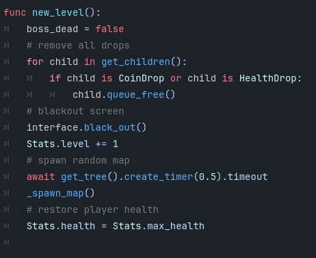

**Map Level Generation Works**
  When a new level begins, the world goes through several important steps:
  * It cleans up the current level by：
     * Removing all coins and health pickups from the previous level
     * Making the screen go dark for a smooth transition
     * Resetting the boss status
  * Then it builds the new level by:
    * Choosing a random map from its collection
    * Placing the player at their starting position
    * Spaning enemies throughout the level
    * Placing the boss in the specific location in the boss room

When you start a new level:
* Your [health](https://github.com/zhxu33/cyberpunk2088/blob/fa4a7e31c05818acc3ac08ec14ac4de9990d9fc3/cyberpunk2088/scripts/world.gd#L75) is restored to maximum 
* The [level](https://github.com/zhxu33/cyberpunk2088/blob/fa4a7e31c05818acc3ac08ec14ac4de9990d9fc3/cyberpunk2088/scripts/world.gd#L70) counter goes up
* A new random [map](https://github.com/zhxu33/cyberpunk2088/blob/fa4a7e31c05818acc3ac08ec14ac4de9990d9fc3/cyberpunk2088/scripts/world.gd#L27) is chosen
* New [enemies and a boss](https://github.com/zhxu33/cyberpunk2088/blob/fa4a7e31c05818acc3ac08ec14ac4de9990d9fc3/cyberpunk2088/scripts/world.gd#L36) are placed in the location of the new map
* The [player](https://github.com/zhxu33/cyberpunk2088/blob/fa4a7e31c05818acc3ac08ec14ac4de9990d9fc3/cyberpunk2088/scripts/world.gd#L32) will spawn at the location of the new map
    
**Difficulty Scaling**
* When the level is up, the map will add [more enemies](https://github.com/zhxu33/cyberpunk2088/blob/fa4a7e31c05818acc3ac08ec14ac4de9990d9fc3/cyberpunk2088/scripts/world.gd#L40) based on the level number
* Maintaining the challenge through strategic [enemy placement](https://github.com/zhxu33/cyberpunk2088/blob/fa4a7e31c05818acc3ac08ec14ac4de9990d9fc3/cyberpunk2088/scripts/world.gd#L42)
* Keeping boss encounters fresh by choosing a [random boss](https://github.com/zhxu33/cyberpunk2088/blob/fa4a7e31c05818acc3ac08ec14ac4de9990d9fc3/cyberpunk2088/scripts/world.gd#L53) in the boss room

**Game Logic - Camera**

For the camera, we choose the very simplest one which is Exercise 2 Stage 1 - Position Lock. The camera will lock on the character and it is the best and easiest on to let the camera follow the player
* In the `CameraController` Script, we extend `Camera2D` and the script creates a reference to the player character which is our player.
* The [camera's behavior](https://github.com/zhxu33/cyberpunk2088/blob/894d764ef305ac81cdd574179f14bcebaae50e42/cyberpunk2088/scripts/camera/camera_controller.gd#L1) is straightforward - when the scene starts, it positions itself at the player's location through the `_ready()` function, and then continuously tracks the player's position every frame using the `_process()` function.

## Boss/Enemy Animation and Visual - Xiuyuan Qi

I implemented animation for all five Boss/Enemy.

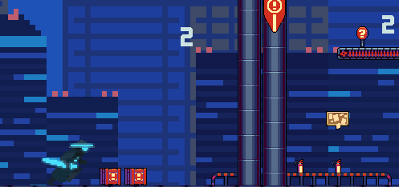
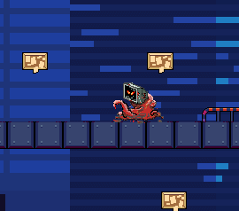
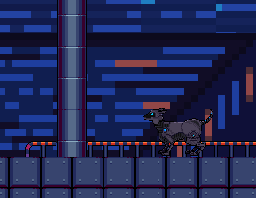
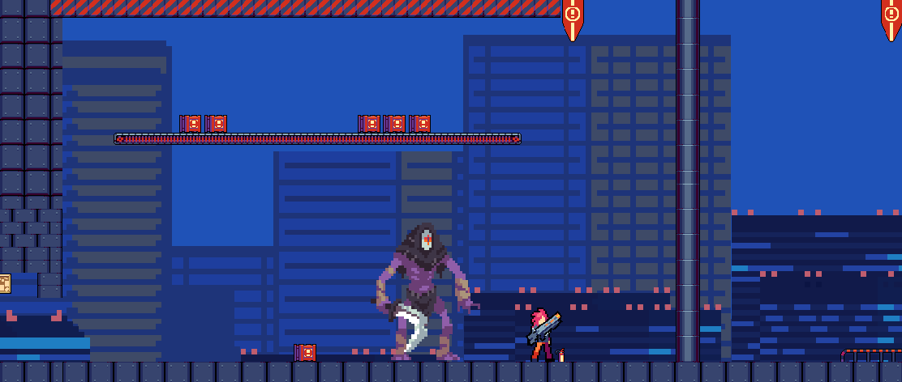
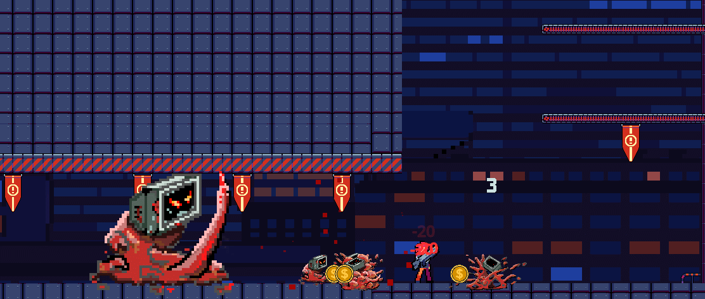

Hitbox disabled/enabled to be consistent with the animation.

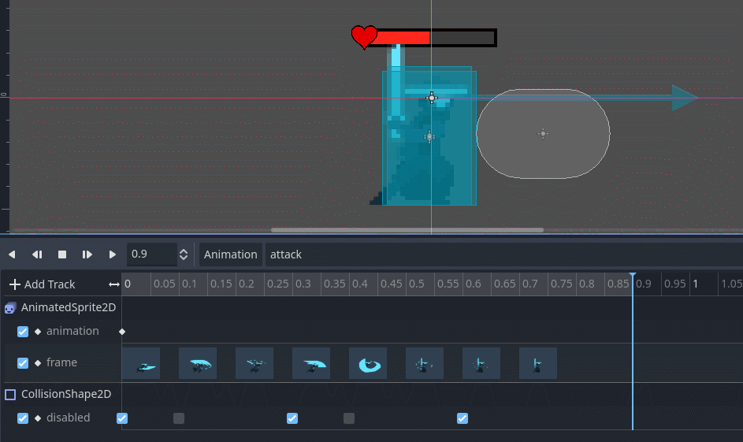
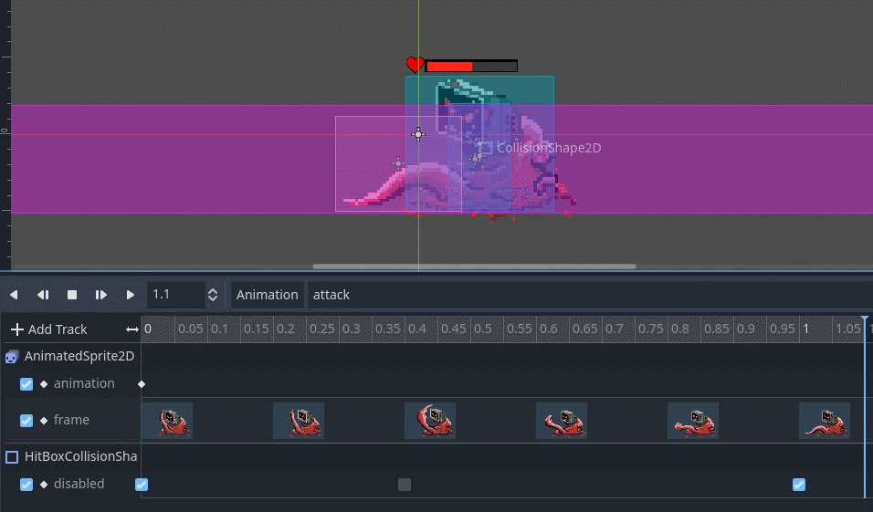
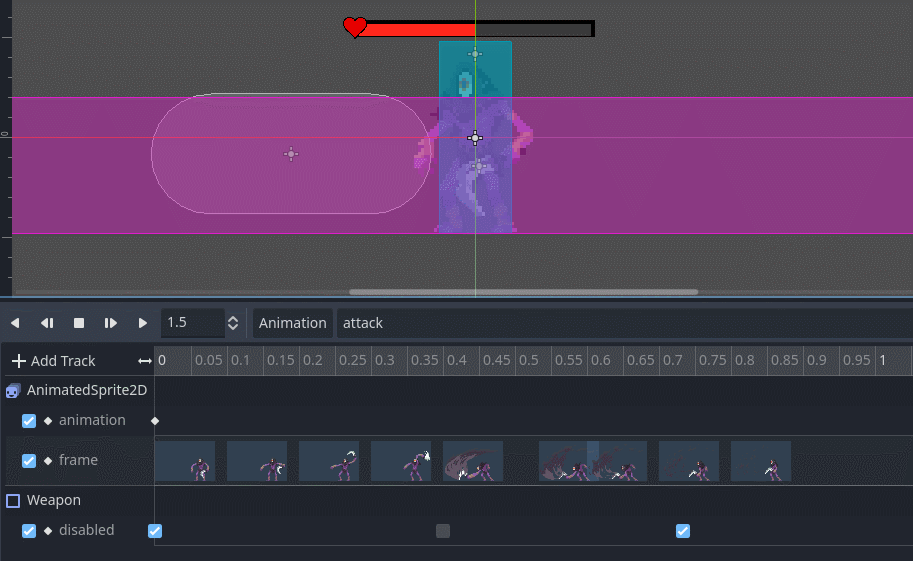

Collision shape that triggers Enemy moves/Boss fight begins.

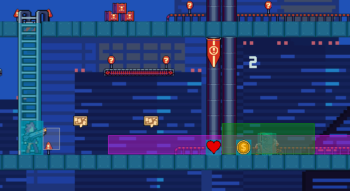
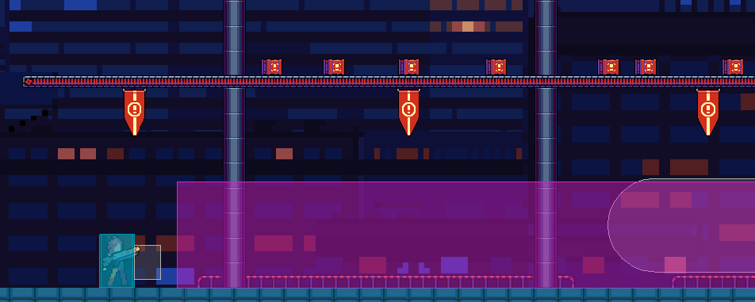
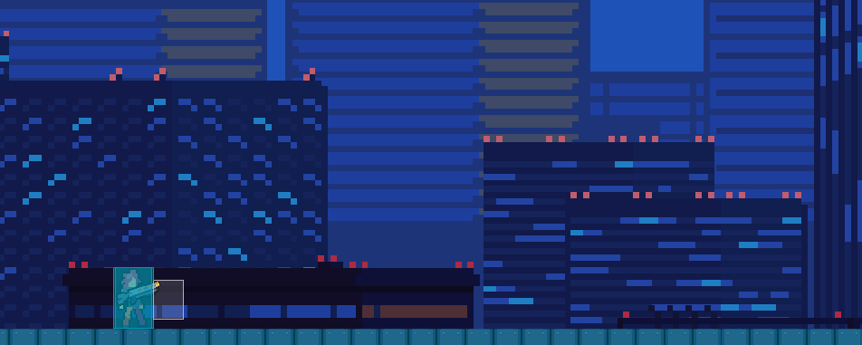

RayCast2D that triggers samurai to chase the player:

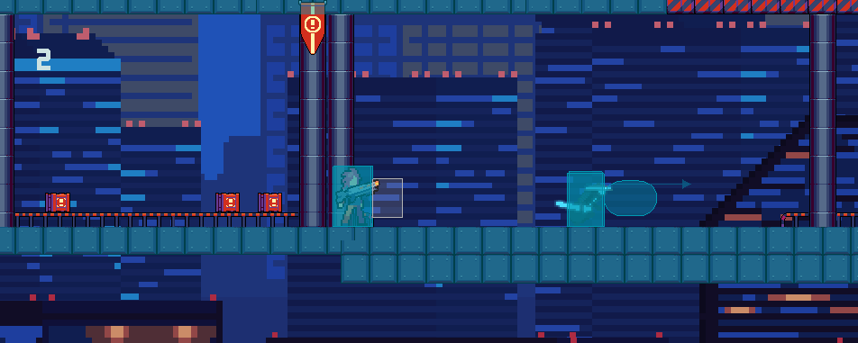

I picked these five enemies and bosses because they all have a strong cyberpunk feel that matches our game’s style. They look futuristic, their animations are smooth, and they just feel right for the world we’ve built. Each one brings its own kind of energy, so when you face them, it feels intense and exciting. They are everything I hoped for when I pictured the perfect enemies for our game.

# Sub-Roles

## Audio

**List your assets, including their sources and licenses.**

**Describe the implementation of your audio system.**

**Document the sound style.** 

## Gameplay Testing

**Add a link to the full results of your gameplay tests.**

**Summarize the key findings from your gameplay tests.**

## Map Design/Map Mechanism

**Document how the narrative is present in the game via assets, gameplay systems, and gameplay.** 

## Press Kit and Trailer

**Include links to your presskit materials and trailer.**

**Describe how you showcased your work. How did you choose what to show in the trailer? Why did you choose your screenshots?**

## Game Feel and Polish - James Xu

### Progression System
* Added random map and enemies generation. The number of enemies increase (`num_spawns + level * num_spawns / 10`) and has higher health after each level. Enemy spawns are placed around the map to ensure full coverage. A spawn can generate more than one enemy with a position offset to avoid overlap.

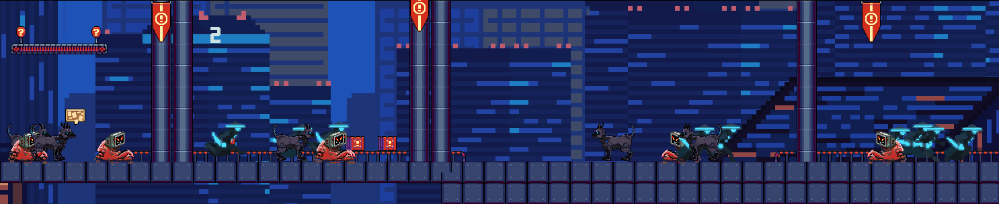
* Enemies and boss have a fixed damage, but their health increases after each level. The formula is `100 + 50 * level` for enemies, and bosses have 5 times the amount of health as enemies.
* Added coins and health restore drops to provide a better incentive for the player to kill enemies. The base coin reward is `20 + 10 * level` for enemies. Health drop has a 20% of dropping from any enemy, which restores 10% of the player's max health. Bosses drop 5 times the amount of enemy coin rewards, and has a guaranteed chance of dropping 5 health restores.

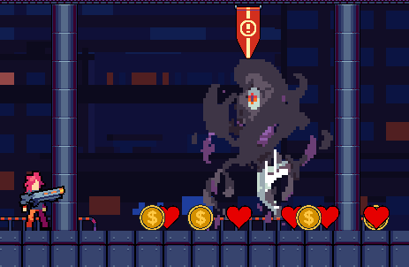 
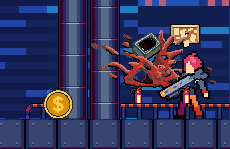

### Upgrades
* Implemented upgrades including `Maximum Health` `Double Jump`, `Movement Speed`, `Jump Power`, `Bullet Count`, `Ricochet`, `Bullet Penetrate`, `Bullet Speed`, `Exploding Attack`, `Attack Damage`, `Attack Speed`, and `Critical Chance`. Each can be upgraded up to level 10 and the cost doubles each time starting from 100 coins. 
* Added bullet explosion and ricochet upgrades to make the gameplay action more fun. Player can avoid attacks more easily with upgrades like double jump and movement speed.

### Combat System
* Added damage indicator for player (red) and enemies (blue), which fades out over 1 second after being damaged.

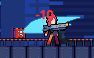
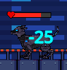

* The health bar is in the enemies and boss scenes as an overhead, which becomes visible for 3 seconds after they were damaged by the player. 

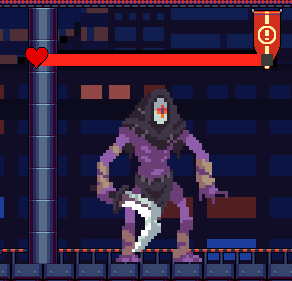
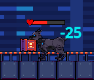

### Enemy Tweaks
* Added explosion effect and jump AI to slime self destruction. This makes it more  difficult for the player to get past slimes without killing them.

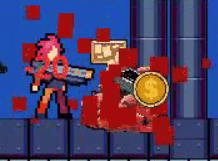

* Robot dog can launch projectiles directly towards the player (rather than left and right). This makes it more challenging to dodge without sufficient movement speed and double jumps.

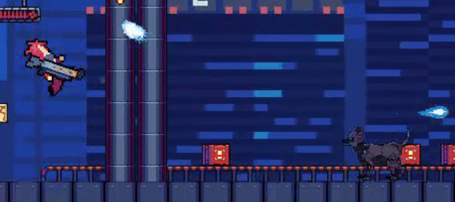

* The slime boss spawn small slime enemies at random intervals towards the player which explodes on contact. The small slimes will pile up and the boss fight becomes progressively more difficult overtime.

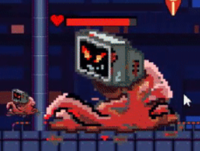

* The shadow boss launches a slash projectile towards the player at random intervals, which is difficult to dodge without sufficient movement speed and double jumps.

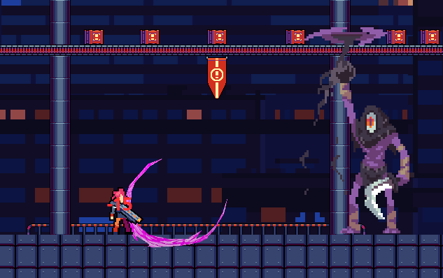

## Boss/Enemy Initial Mechanism and Design - Xiuyuan Qi

In addition to the Boss/Enemy Animation and Visual, I implemented all their basic functionalities.

### Robot Guard Dog's initial mechanism

Initially, the dog shot its bullet horizontally(either left or right) based on the player's location. James further developed it so that it could shoot directly towards the player.

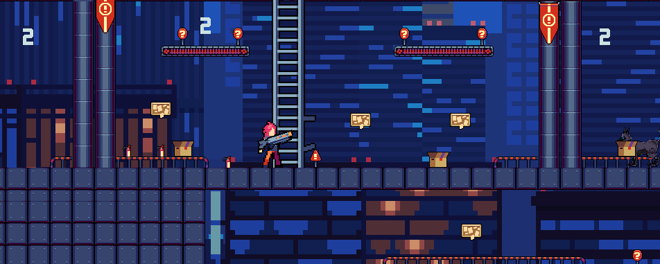

### Self-destructive Slime's initial mechanism

Just like the final mechanism you play, it was also player-detected and exploded with damage to the player. And it was easier to avoid the blast damage than the present one. We buffed it because it needs to be fitted with what a self-destructive slime looks like.

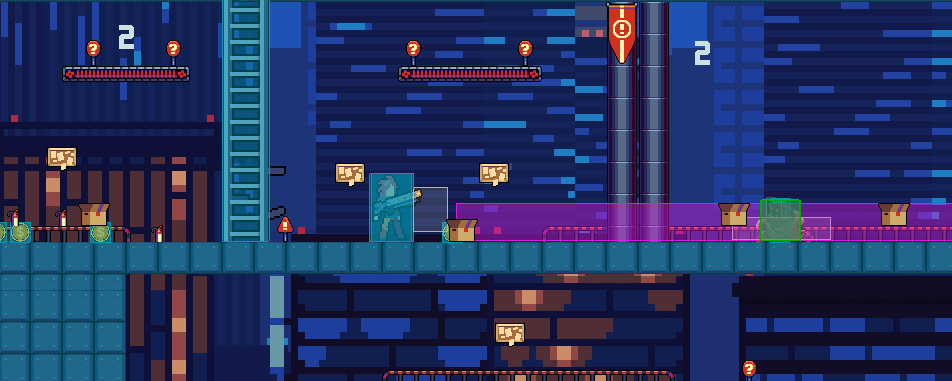

### Cyber Samurai's initial/final mechanism

Cyber Samurai will chase the player after Raycast2D collides with the player. It is really fast and kills you if you don't kill it first.

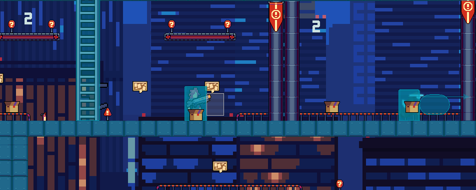

### Boss from exercise 1 initial mechanism

I transplanted the boss that appeared in Exercise 1 here and used Zixuan's boss fight code to complete the initial boss fight design.

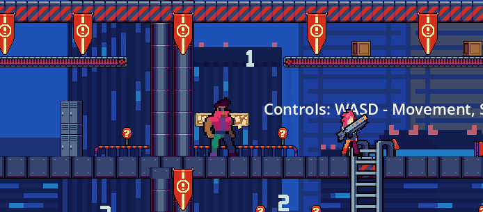

### Boss Slime's initial mechanism

It chased the player after the player triggered the boss fight. It could only melee attack the player. James further implemented the feature that can throw small self-destructive slime.

