# The title of your game #

## Summary ##

**A paragraph-length pitch for your game.**

## Project Resources

[Web-playable version of your game.](https://itch.io/)  
[Trailor](https://youtube.com)  
[Press Kit](https://dopresskit.com/)  
[Proposal: make your own copy of the linked doc.](https://docs.google.com/document/d/1qwWCpMwKJGOLQ-rRJt8G8zisCa2XHFhv6zSWars0eWM/edit?usp=sharing)  

## Gameplay Explanation ##

**In this section, explain how the game should be played. Treat this as a manual within a game. Explaining the button mappings and the most optimal gameplay strategy is encouraged.**

**Add it here if you did work that should be factored into your grade but does not fit easily into the proscribed roles! Please include links to resources and descriptions of game-related material that does not fit into roles here.**

# Main Roles #

Your goal is to relate the work of your role and sub-role in terms of the content of the course. Please look at the role sections below for specific instructions for each role.

Below is a template for you to highlight items of your work. These provide the evidence needed for your work to be evaluated. Try to have at least four such descriptions. They will be assessed on the quality of the underlying system and how they are linked to course content. 

*Short Description* - Long description of your work item that includes how it is relevant to topics discussed in class. [link to evidence in your repository](https://github.com/dr-jam/ECS189L/edit/project-description/ProjectDocumentTemplate.md)

Here is an example:  
*Procedural Terrain* - The game's background consists of procedurally generated terrain produced with Perlin noise. The game can modify this terrain at run-time via a call to its script methods. The intent is to allow the player to modify the terrain. This system is based on the component design pattern and the procedural content generation portions of the course. [The PCG terrain generation script](https://github.com/dr-jam/CameraControlExercise/blob/513b927e87fc686fe627bf7d4ff6ff841cf34e9f/Obscura/Assets/Scripts/TerrainGenerator.cs#L6).

You should replay any **bold text** with your relevant information. Liberally use the template when necessary and appropriate.

## Producer

**Describe the steps you took in your role as producer. Typical items include group scheduling mechanisms, links to meeting notes, descriptions of team logistics problems with their resolution, project organization tools (e.g., timelines, dependency/task tracking, Gantt charts, etc.), and repository management methodology.**

## User Interface and Input - James Xu

**Describe your user interface and how it relates to gameplay. This can be done via the template.**

The `Interface` scene is placed directly under the root node `World`, where other scripts can easily access and manipulate the UI. The scene contains a `CanvasLayer`, which contains all of the game UI elements including `StartScreen`, `Health`, `Coins`, `Level`, `Dialogue`, `Shop`, `EndScreen`, and `Blackout`.

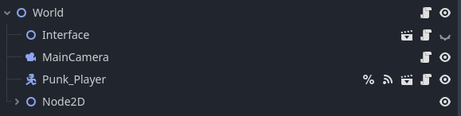
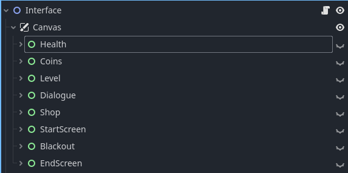

Each UI element is placed under a control node, where I assign Anchor Presets so that the positioning is responsive and works with different screen sizes. The screen resolution only defaults to 1920x1080 for now, but we may add mobile support if there was more time.

The Interface scene contains a master script [`interface.gd`](https://github.com/zhxu33/cyberpunk2088/blob/main/cyberpunk2088/scripts/interface/interface.gd) which handles all UI interactions. I set up [`stats.gd`](https://github.com/zhxu33/cyberpunk2088/blob/main/cyberpunk2088/scripts/global/stats.gd) which contains autoload global variables including coins, level, health, max_health, and upgrades. This is accessed in the interface to display player statuses.

### Start Screen
The start screen appears when the player first joins the game. It has a title label and a blue background that fades out over 2 seconds, which transitions into the game map and player. After the blue background fades, the player can press `Start Game` button to begin playing.

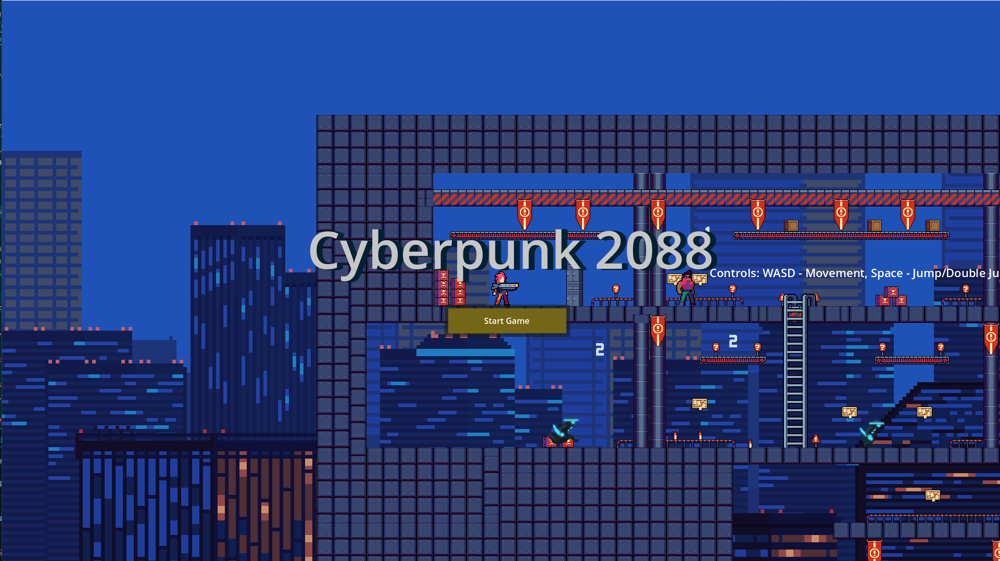

### Health Bar
The Health Bar is displayed on the top center of the screen canvas. It contains  a `ProgressBar` node, which stores the player's `max_health` into Min Value, and player's `health` into value. It contains a `TextureRect` heart icon and label indicating the player's health.

The health bar is in the enemies and boss scenes as an overhead, which becomes visible for 3 seconds after they were damaged by the player. 

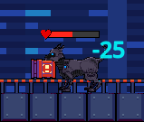

### Coin
The coins are displayed on the top right corner of the screen canvas, which is the game currency used to purchase upgrades. It contains a `TextureRect` coin icon on the left of the value.

### Level
The level label is displayed on the top left corner of the screen canvas, indicating the current difficulty of the game.

### Dialogue
The dialogue is displayed on the bottom center of the screen canvas. It contains a title label, text description label, `cancel`, and a `confirm` button. Pressing the cancel button will always close the dialog without doing anything.

The Merchant Biker has a dialogue where pressing `confirm` will open up the shop UI.

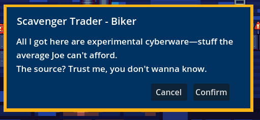

The portal has two dialog states depending on the status of the boss.

If the boss is dead, the player can proceed to the next level by pressing `confirm`. 

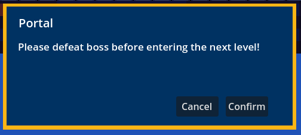

If the boss is alive, pressing `confirm` will not do anything.

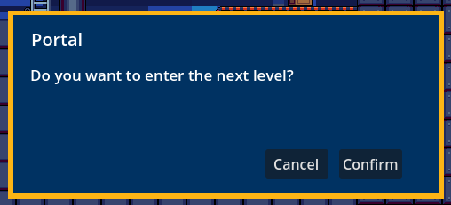

### Shop
The shop opens after pressing `confirm` on the Biker dialogue. There is a `close` button on the top right corner which is used to exit the shop. It has a `title` "Upgrades" and contains a `GridContainer` inside a `ScrollContainer` which is designed to format the `UpgradeItem` node automatically, and adds a scroll wheel incase the shop interface isn't big enough to fit all upgrades.

The `UpgradeItem` node contains a upgrade name label, cost label, coin icon, and a button with transparent black background which can be clicked on to upgrade. In the interface script, `UpgradeItem` node is cloned based on the available upgrades in `stats.gd` and placed under the `GridContainer` to be formatted automatically.

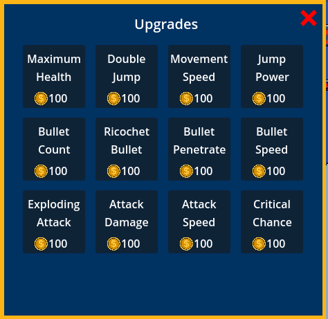

### Death Screen
Once the player's health reaches 0, the death screen becomes visible and all inputs are disabled. The user can press a `New Game` button to restart the game from level 0, with all of their upgrades and coins reset. 

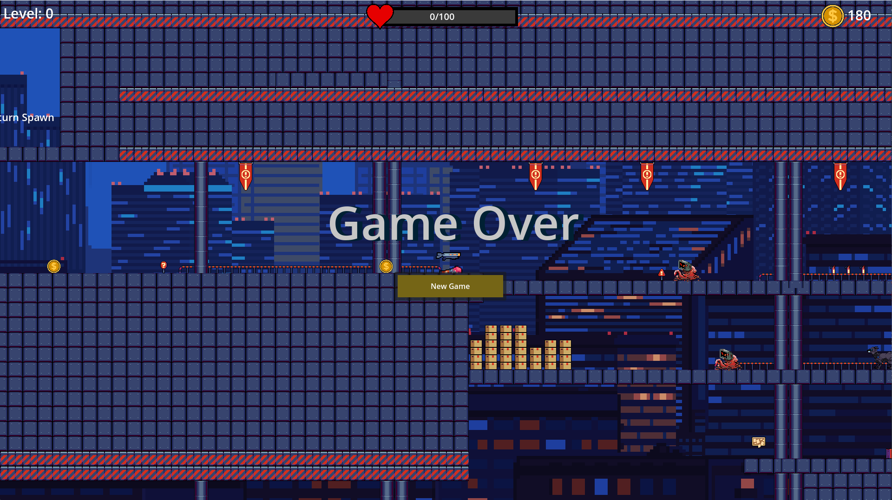

## User Input

The game input is configured in the project's Input Map settings. This currently only supports players with a mouse and keyboard. All inputs are handled in `player.gd` physics process. All inputs are disabled when the Start Screen or Death Screen is open, and re-enabled once the player starts a new game.

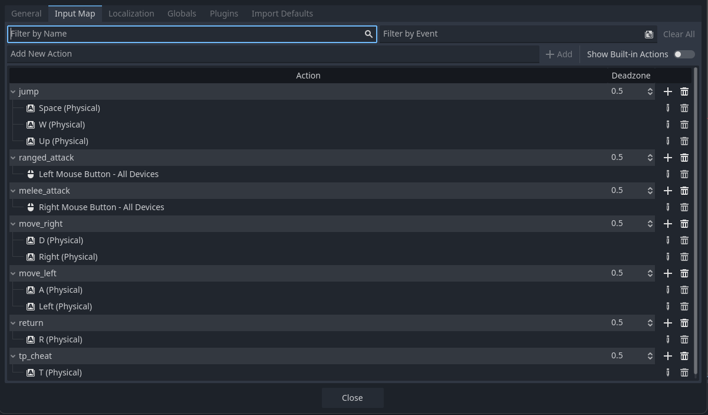

### move_left
The player can move left by holding `A` or `Left Arrow` key.

### move_right
The player can move right by holding `D` or `Right Arrow` key.

### jump
The player can jump using `W`, `Space`, or `Up Arrow` keys. The `jump` input is also used for double jump and climbing ladders.

### ranged_attack
The player can use ranged attack by holding `Left Click` with the mouse.

### meele_attack
The player can use meele attack by `Right Click` with the mouse.

### return
The player can return to spawn by holding `R` for 1 second.

### tp_cheat
The player can teleport to the direction of their mouse by pressing `T`. This is used for testing purposes.\

## Movement/Physics

**Describe the basics of movement and physics in your game. Is it the standard physics model? What did you change or modify? Did you make your movement scripts that do not use the physics system?**

## Animation and Visuals

**List your assets, including their sources and licenses.**

**Describe how your work intersects with game feel, graphic design, and world-building. Include your visual style guide if one exists.**

## Game Logic

**Document the game states and game data you managed and the design patterns you used to complete your task.**

# Sub-Roles

## Audio

**List your assets, including their sources and licenses.**

**Describe the implementation of your audio system.**

**Document the sound style.** 

## Gameplay Testing

**Add a link to the full results of your gameplay tests.**

**Summarize the key findings from your gameplay tests.**

## Narrative Design

**Document how the narrative is present in the game via assets, gameplay systems, and gameplay.** 

## Press Kit and Trailer

**Include links to your presskit materials and trailer.**

**Describe how you showcased your work. How did you choose what to show in the trailer? Why did you choose your screenshots?**

## Game Feel and Polish - James Xu

### Progression System
* Added random map and enemies generation. The number of enemies increase (`num_spawns` + level * `num_spawns`/ 10) and has higher HP after each level. Enemy spawns are placed around the map to ensure full coverage. A spawn can generate more than one enemy with a position offset to avoid overlap.
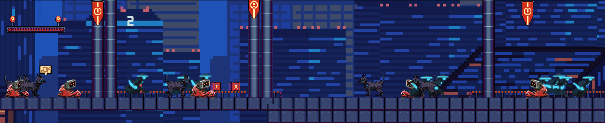
* Added coins and health restore drops to provide a better incentive for the player to kill enemies. Health drop has a 20% of dropping from any enemy, which restores 10% of the player's max health. Bosses drop 5 times the amount of enemy rewards.
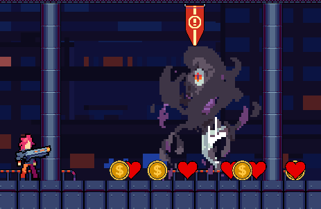 
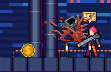

### Upgrades
* Implemented upgrades including `Maximum Health` `Double Jump`, `Movement Speed`, `Jump Power`, `Bullet Count`, `Ricochet`, `Bullet Penetrate`, `Bullet Speed`, `Exploding Attack`, `Attack Damage`, `Attack Speed`, and `Critical Chance`. Each can be upgraded up to level 10 and the cost doubles each time starting from 100 coins. 
* Added bullet explosion and ricochet upgrades to make the gameplay action more fun. Player can avoid attacks more easily with upgrades like double jump and movement speed.

### Enemy Tweaks
* Added explosion effect and jump AI to slime self destruction. It is very difficult for the player to get past the slime without killing it.

* Robot dog can launch projectiles directly towards the player (rather than left and right).

* The slime boss spawn small slime enemies at random intervals towards the player which explodes on contact. The small slimes will pile up and the boss fight becomes progressively more difficult overtime.

* The shadow boss launches a slash projectile towards the player at random intervals.
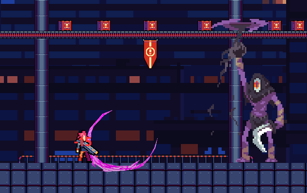
* Other minor changes like enemy stats/speed, rewards, hitbox tweaks to ensure smooth game progression and balance.